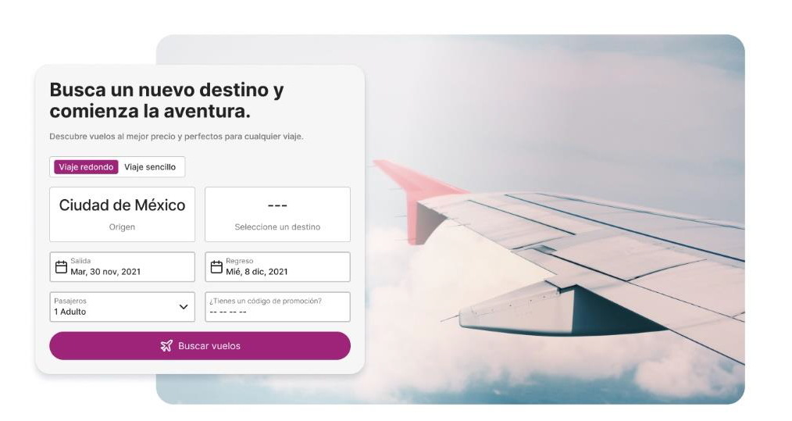
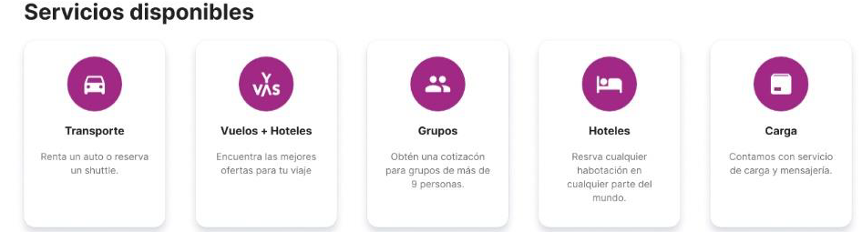
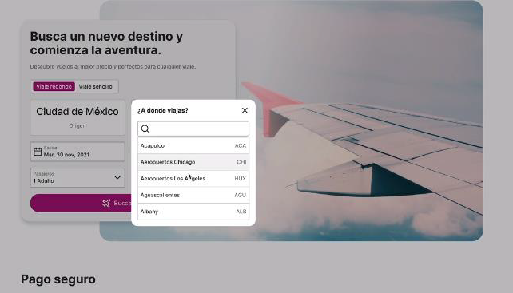
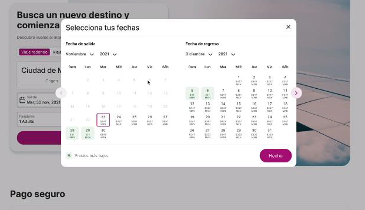
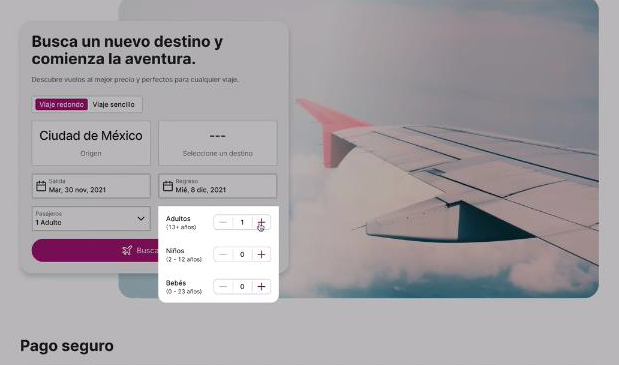
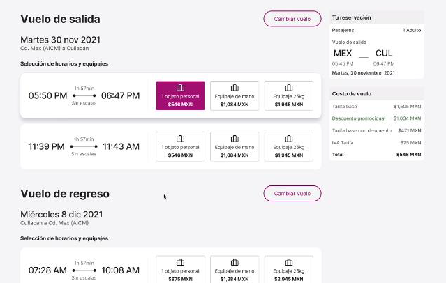
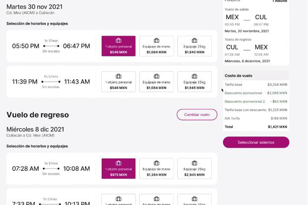
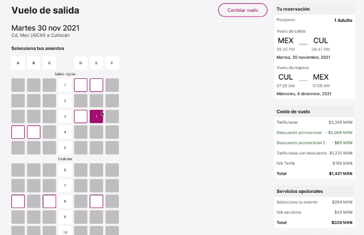
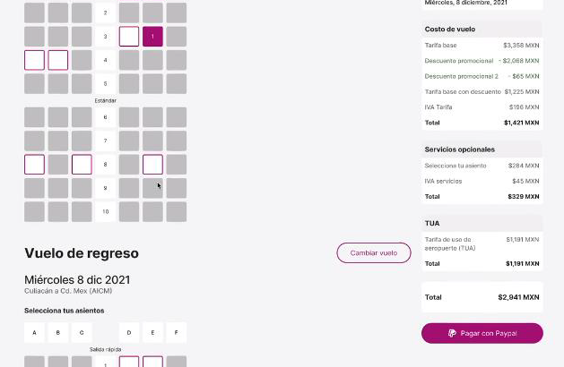

# Install dependencies

- npm install

# Objetivo: Construir un aplicativo para comprar tickets de un vuelo. El aplicativo

El aplicativo de cumplir con los siguientes requerimientos técnicos:
1. Cumplir con los estilos del diseño proporcionado, implementando cualquier framework CSS de su preferencia.
2. Implementar hosting para el despliegue del JSON-server que contenga la información de los vuelos y pasajeros.
3. Filtro de búsqueda de vuelos debe filtrar por:   
   a. Viaje de ida (sencillo) o viaje de ida y regreso (redondo)   
   b. Vuelo de origen y destino

c. Fechas de viaje

d. Cantidad de pasajeros

4. Al dar click en el botón de buscar vuelo, debe validar si están completos los criterios mínimos de búsqueda (todos los mencionados en el ítem No. 3) y redireccionar a una nueva página donde el usuario tendrá la oportunidad de seleccionar los vuelos programados en la fecha seleccionada:

Nota: En la parte derecha de la página se debe mostrar al usuario los criterios de búsqueda aplicados y los costos asociados a los rubros a cancelar según la selección actual del vuelo, y a su vez, cada itinerario debe tener relacionado como mínimo la siguiente información: la duración del viaje, si tiene escalas y el precio del pasaje.
5. Al dar click en el botón de cambiar vuelo, debe redireccionar al usuario a la página de inicio, donde pueda modificar los criterios de búsqueda y realizar el cambio de vuelo.
6. Cuando el usuario haya seleccionado el(los) vuelo(s) y el tipo de equipaje a llevar, debe aparecer un botón de Seleccionar asientos:

7. Al dar click sobre el botón de seleccionar asientos, debe redireccionar al usuario a la siguiente página:

8. En la página de selección de asientos se le debe mostrar al usuario los asientos disponibles, ocupados y seleccionados.
9. Cuando el usuario haya completado la selección de los asientos tanto del vuelo de salida como de regreso, se debe activar el botón de pagar con Paypal.

10. Al dar click sobre el botón Pagar con Paypal, debe redireccionar al usuario a una nueva página donde debe ingresar los datos personales de los pasajeros, información correspondiente al medio de pago y confirmar la compra de los pasajes.
11. Una vez que el usuario haya confirmado la compra, el aplicativo debe indicarle que la compra fue exitosa y suministrarle la información
    correspondiente al o los pasajes comprados, como: el número de reserva, el código del vuelo, asientos comprados, etc.
12. En el aplicativo se debe evidenciar el uso de:
    • Librería JavaScript React js
    • Diseño responsive
    • Enrutamiento dinámico
    • Componentes funcionales
    • Hooks de estado, efecto, personalizados y de React Router.
    • Peticiones HTTPs con Axios
    • Implementación de JSON server (API)
    • Implementación de Sweetalert para mostrar las alertas.
    • Despliegue del aplicativo en GitHub pages o vercel
    Nota: Todas las páginas deben conservar los mismos estilos, para el manejo de fechas y horas se sugiere uso de la librería luxon. Cualquier funcionalidad adicional implementada, será tenida en cuenta como punto extra sobre la calificación del proyecto, después de haber completado los requerimientos mínimos.
